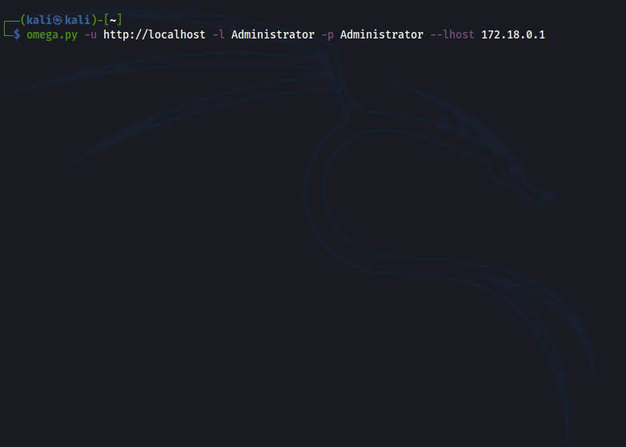

  

# Omega - From Wordpress admin to pty

The Linux tool to automate the process of getting a pty once you got admin credentials in a Wordpress site. Keep in mind that right now Omega only can attack Linux hosts.



## How does it work?

First, Omega gets an admin session in the Wordpress site and using web scrapping, it extracts the current template used by wordpress. After that, it will use the template editor to inject a simple web shell.

Once everything is set up, Omega will spin up a listenner, execute a reverse shell using the web shell injected and wait for the shell to connect back. Before giving the control to the user, Omega will try to stabilize the shell and get a pty.

If stabilization is not possible using the methods Omega has, a non tty shell will be provided that can be stabilize without problems using any method you want.

## Requirements

You need Python 3 installed in your system and also some dependencies that can be installed executing (Keep in mind that this tool only works in Linux):

```bash
pip3 install -r requirements.txt
```

You can use a virtual env to install the dependencies or intall them system wide.

## Usage

If you have all the requirements you can start playing with Omega! You can add the repository folder to your `PATH` and execute the tool everywhere.

```
Omega - From Wordpress admin to pty

usage: omega.py [-h] [-v] [--no-pty] -u WP_URL -l USERNAME -p PASSWORD -H LHOST [-P LPORT]

Provides a reverse shell (stabilized if possible) to a Wordpress host. You need admin credentials!

optional arguments:
  -h, --help            show this help message and exit
  -v, --version         show program's version number and exit
  --no-pty              if this flag is set, no shell stabilization is perform
  -u WP_URL, --wp-url WP_URL
                        the target Wordpress url
  -l USERNAME, --username USERNAME
                        Wordpress admin user to use for login
  -p PASSWORD, --password PASSWORD
                        Wordpress admin password to use for login
  -H LHOST, --lhost LHOST
                        the ip where the reverse shell should connect to
  -P LPORT, --lport LPORT
                        the port used to listen for the reverse shell (Default: 8080)
```
